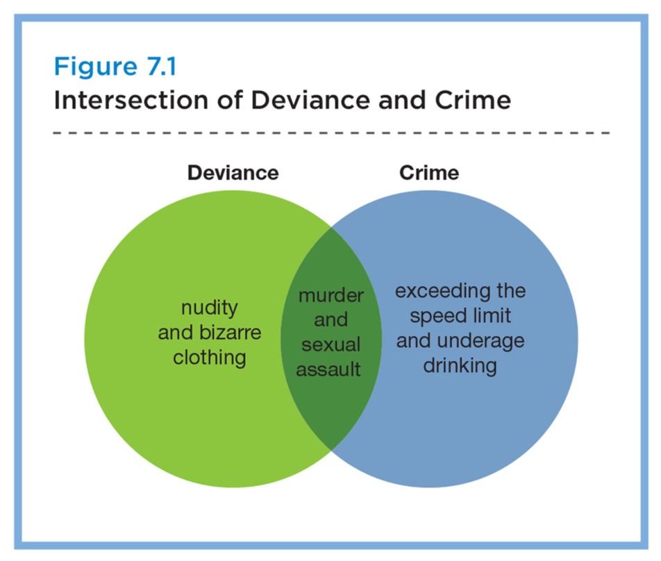

### Crime & Deviance
SOC100: Introduction to Sociology  
Brian McPhail  
Purdue University

---
@snap[west]
- **Norms**: rules of conduct that specify appropriate behavior in a given range of social situations  
- **Deviance**: modes of action that do not conform to the norms or values held by most members of a group or society  
- **Laws**: rules of behavior established by a political authority and backed by state power  
- **Crime**: result of any action that contravenes the laws established by a political authority
@snapend

---
@snap[midpoint span-80]

@snapend
---
@snap[north span-100]
### Social Control
@snapend
@snap[west span-90]
**social control**: the regulation and enforcement of norms; organized action intended to change people’s behavior
@ul
- the goal of social control is to maintain social order
@ulend
@snapend
---
@snap[north span-100]
### Social Control
@snapend

@ul
- **penal**: punishment
- **compensatory**: offender pays victim to compensate for harm
- **therapeutic**: therapy to return individuals to a normal state  
- **conciliatory**: reconcile parties of a dispute and mutually restore harmony

---
@snap[north span-100]
### Social Control
@snapend

@ol
1. **Sanctions**: a mode of reward or punishment that reinforces socially expected forms of behavior; informal or formal
2. **Discipline** (Government): via modern institutions like prisons, public schools, armies, asylums, hospitals, and workplaces
3. **Risk Management**: interventions designed to reduce the likelihood of undesirable events occurring based on an assessment of probabilities of risk
@ulend
@snapend

Note:

Risk Management Ex.: Using alarm systems, CCTV surveillance cameras, adding or improving lighting, broadcasting irritating sounds, or making street furniture uncomfortable are all ways of working on the cost/benefit analysis of potential deviants or criminals before they act rather than acting directly on the deviants or criminals themselves.

---
@snap[north span-100]
### Sociological Theories of Crime
@snapend
 - Functionalist
 - Conflict Theory
 - Symbolic Interactionist

---
@snap[north span-100]
### Functionalist
@snapend
- Deviance is a key component of a functioning society.
  1. it challenges people’s present views
  2. when deviance is punished, it reaffirms currently held social norms

- Deviance happens when society experiences structural tensions and an absence of moral regulation in society (Durkheim & *anomie*).

---
@snap[north span-100]
### Functionalist
@snapend
- Most likely in communities with weak social ties and the absence of social control (social disorganization theory).
- Access to socially acceptable goals plays a part in determining whether a person conforms or deviates (strain theory).

---
@snap[north span-100]
### Conflict Theory
@snapend
- Individuals choose to engage in deviant behavior in response to inequalities of the capitalist system.

- **Crimes of accommodation**: ways in which individuals cope with conditions of oppression

- Institutions of normalization and the criminal justice system are mechanisms that maintain the power structure of the political-economic order.

Note:
Predatory crimes like break and enter, robbery, and drug dealing are often simply economic survival strategies.
Personal crimes like murder, assault, and sexual assault are products of the stresses and strains of living under stressful conditions of scarcity and deprivation.
Defensive crimes like economic sabotage, illegal strikes, civil disobedience, and eco-terrorism are direct challenges to social injustice.

---
@snap[north span-100]
### Interactionist
@snapend
- How does behavior get defined as deviant, and why are certain groups of people *labeled* as deviant?

- Emphasizes the social processes through which deviant activities and identities are socially defined and then “lived” as deviant.

- Deviance is created through the social interactions of individuals and various authorities. Deviance is learned from close others.  

---
@snap[north span-100]
### Labeling Theory
@snapend

- **Labeling theory**: people become “deviant” because certain labels are attached to their behavior by political authorities and others.

- What is considered deviant is determined not so much by the behaviors themselves or the people who commit them, but by the reactions of others to these behaviors.

- Rules defining deviance express the power structure of society.

---
@snap[north span-100]
### Labeling Theory
@snapend

- Once someone is labeled deviant, then stigmatized as deviant and not trusted by society. Then relapse into further criminal behavior.
  - *Primary deviation* – the actions that cause others to label one as a deviant
  - *Secondary deviation* – occurs when an individual accepts the label of deviant and acts accordingly

---
@snap[north span-100]
### Labeling Theory
@snapend

- Assumes that no act is intrinsically criminal, but may become so through the formulation of laws and their interpretation by police, courts, and correctional institutions.

---
@snap[north span-100]
### Conclusion
@snapend
- Deviance is, essentially, an issue of social definition.
- A sociological perspective on crime/deviance:˜
  - Which social control strategies are effective?
  - Who commits crimes and why?
  - Why are certain acts labeled normal/deviant/criminal?
---
### Fact Sheet Questions
1. What is the source of the data in each table? Does it seem legitimate?
2. What is the population the table describes? What are the categories?
3. What are the trends in the data? What story is it telling?
4. What is the problem? What should be done?

---
